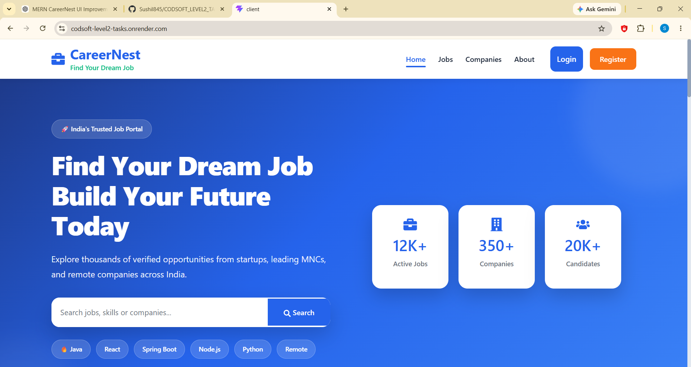
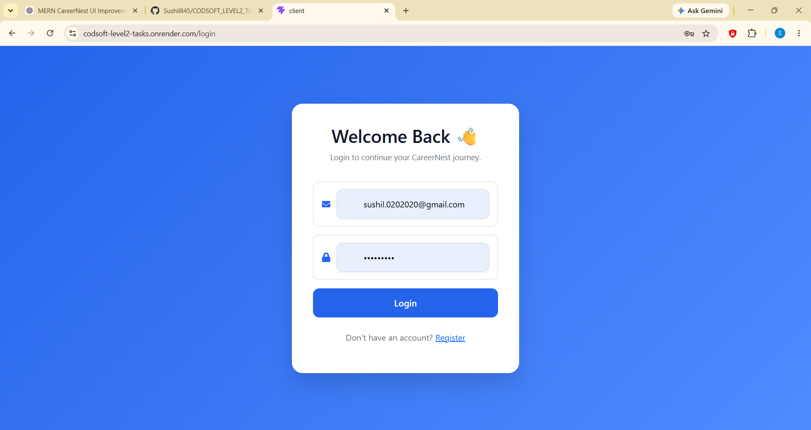
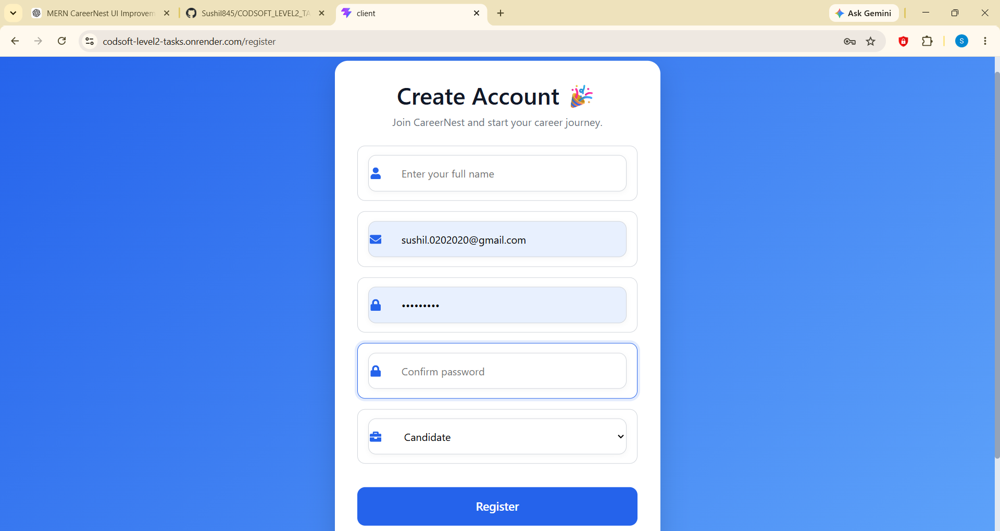
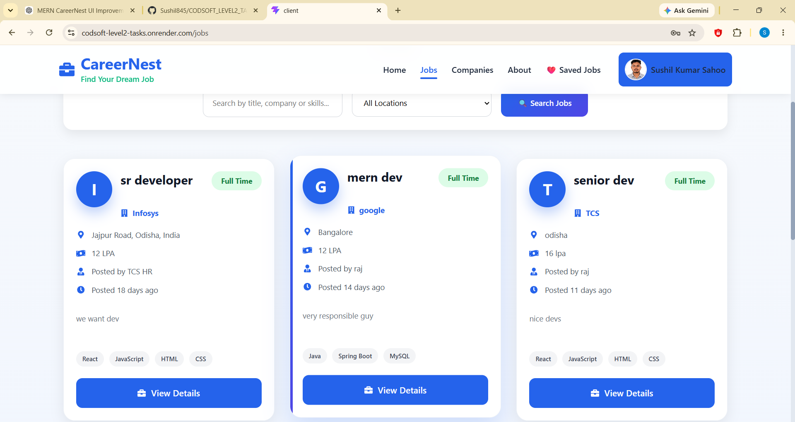
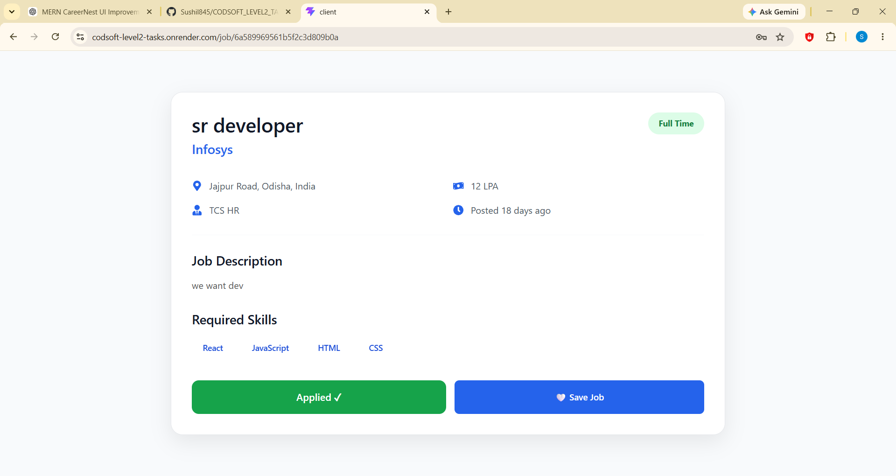
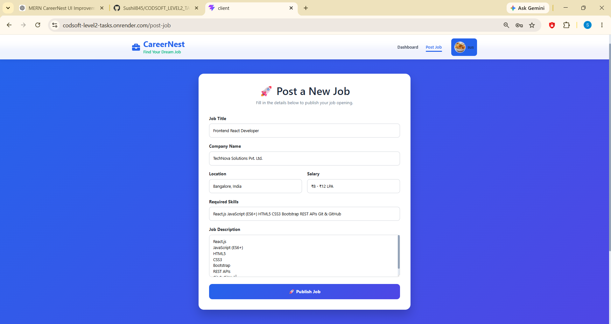
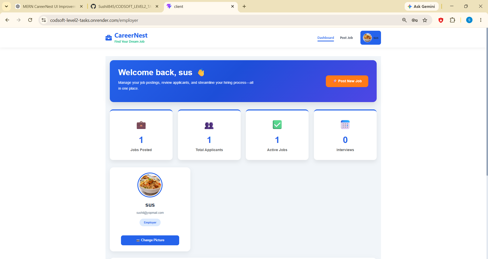
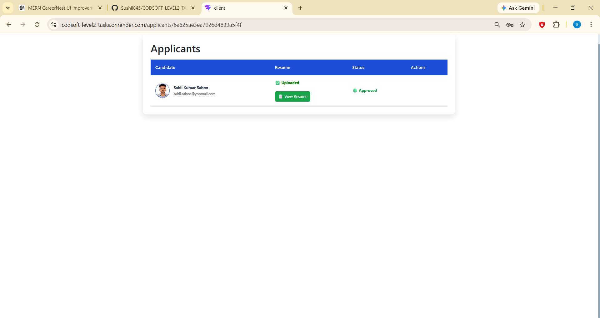

# 💼 CareerNest – MERN Job Portal

<p align="center">
  
  
  
  
  
</p>

<p align="center">
A full-stack MERN Job Portal that connects job seekers and employers through a secure, responsive, and user-friendly platform.
</p>

---

# 🌐 Live Demo

🔗 **Application:**  
https://codsoft-level2-tasks.onrender.com/

---

# 📖 About The Project

CareerNest is a modern Job Portal built using the MERN Stack. The platform enables employers to post job openings, manage applicants, and update job listings, while candidates can browse jobs, apply online, and manage their applications.

The application implements secure JWT authentication, role-based access control, responsive design, and a clean user interface to provide a seamless recruitment experience.

---

# ✨ Features

## 🔐 Authentication

- User Registration
- Secure Login
- JWT Authentication
- Protected Routes
- Logout Functionality
- Role-Based Access (Employer & Candidate)

---

## 👨‍💼 Employer Features

- Post New Jobs
- Edit Job Listings
- Delete Jobs
- View Posted Jobs
- View Applicants
- Employer Dashboard

---

## 👨‍🎓 Candidate Features

- Browse Available Jobs
- View Job Details
- Apply for Jobs
- Candidate Dashboard
- Track Applied Jobs

---

## 🎨 User Interface

- Responsive Design
- Bootstrap 5
- React Icons
- Toast Notifications
- Professional Dashboard
- Mobile Friendly Layout

---

# 🛠 Tech Stack

## Frontend

- React.js
- React Router DOM
- Axios
- Bootstrap 5
- React Icons
- React Toastify
- CSS3

---

## Backend

- Node.js
- Express.js
- MongoDB Atlas
- Mongoose
- JWT Authentication
- bcryptjs
- CORS

---

## Deployment

- Render (Frontend)
- Render (Backend)
- MongoDB Atlas

---

# 📂 Project Structure

```
CareerNest
│
├── client
│   ├── src
│   │   ├── api
│   │   ├── components
│   │   ├── pages
│   │   ├── services
│   │   └── App.jsx
│   │
│   └── package.json
│
├── server
│   ├── config
│   ├── controllers
│   ├── middleware
│   ├── models
│   ├── routes
│   ├── server.js
│   └── package.json
│
├── screenshots
│
└── README.md
```

---

# 📸 Application Screenshots

## 🏠 Home Page



---

## 🔐 Login



---

## 📝 Register



---

## 💼 Browse Jobs



---

## 📄 Job Details



---

## ➕ Create Job



---

## 👨‍💼 Employer Dashboard



---

## ✏ Edit Job


---

## 👥 Applicants




# 🚀 Getting Started

## Clone Repository

```bash
git clone https://github.com/Sushil845/CODSOFT_LEVEL2_TASKS.git
```

Navigate to the project folder.

```bash
cd JobBoard
```

## Install Backend

```bash
cd server
npm install
npm start
```

## Install Frontend

```bash
cd client
npm install
npm run dev
```

---

# 💼 Sample Job Listing

### Job Title

**Frontend React Developer**

### Company

**TechNova Solutions Pvt. Ltd.**

### Location

**Bangalore, India**

### Salary

**₹8 – ₹12 LPA**

### Experience

**1–3 Years**

### Job Description

We are looking for a passionate Frontend React Developer to join our growing development team. The ideal candidate should have strong knowledge of React.js, JavaScript, HTML, CSS, and REST APIs. You will work closely with UI/UX designers and backend developers to build responsive, high-performance web applications while ensuring an excellent user experience.

### Skills Required

- React.js
- JavaScript (ES6+)
- HTML5
- CSS3
- Bootstrap
- REST APIs
- Git & GitHub

---

# 🎯 Core Functionalities

- ✅ User Authentication
- ✅ Role-Based Access
- ✅ Create Job
- ✅ Edit Job
- ✅ Delete Job
- ✅ Browse Jobs
- ✅ Apply for Jobs
- ✅ Employer Dashboard
- ✅ Candidate Dashboard
- ✅ View Applicants
- ✅ Responsive UI

---

# 🚀 Future Enhancements

- Resume Upload
- Company Profiles
- Job Categories
- Email Notifications
- Interview Scheduling
- Saved Jobs
- Job Recommendations
- Admin Dashboard
- Dark Mode
- Real-Time Notifications

---

# 👨‍💻 Author

## **Sushil Kumar Sahoo**

**B.Tech Computer Science & Engineering**

**Java Full Stack Developer | MERN Stack Developer | SAP ABAP Learner**

### GitHub

https://github.com/Sushil845

### LinkedIn

https://www.linkedin.com/in/sushil-kumar-sahoo-919a1a337/

---

# 🤝 Contributing

Contributions are welcome!

Feel free to fork this repository, create a new branch, and submit a Pull Request.

---

# ⭐ Support

If you found this project useful, please consider giving it a ⭐ on GitHub.

---

