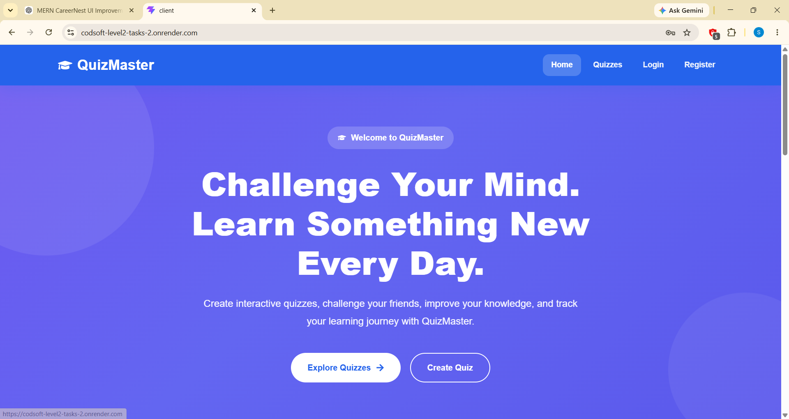
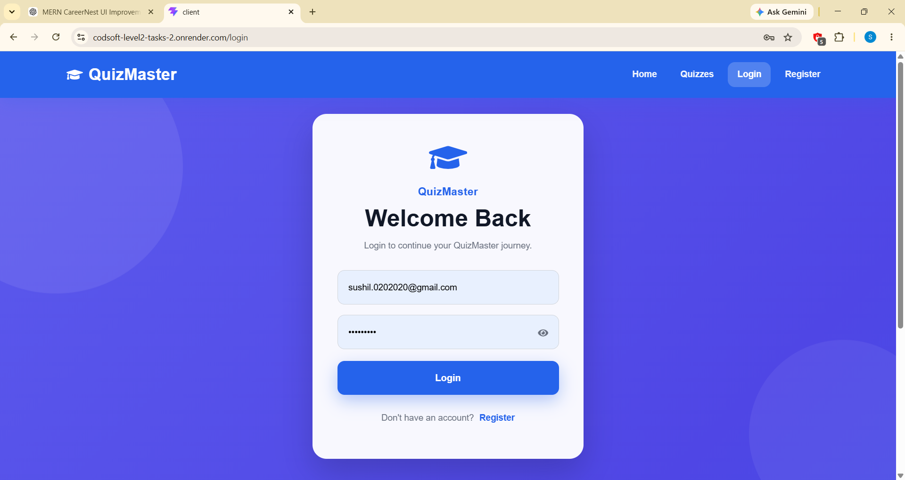
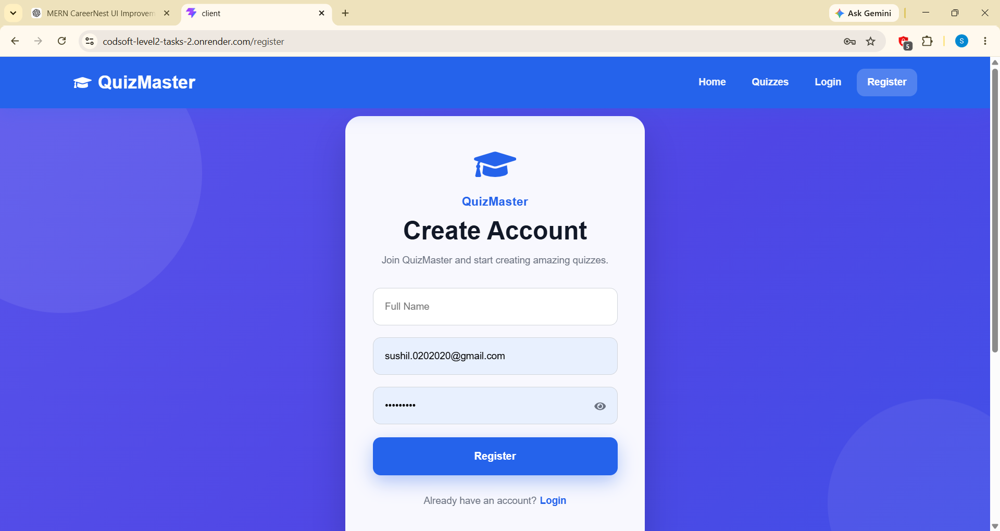
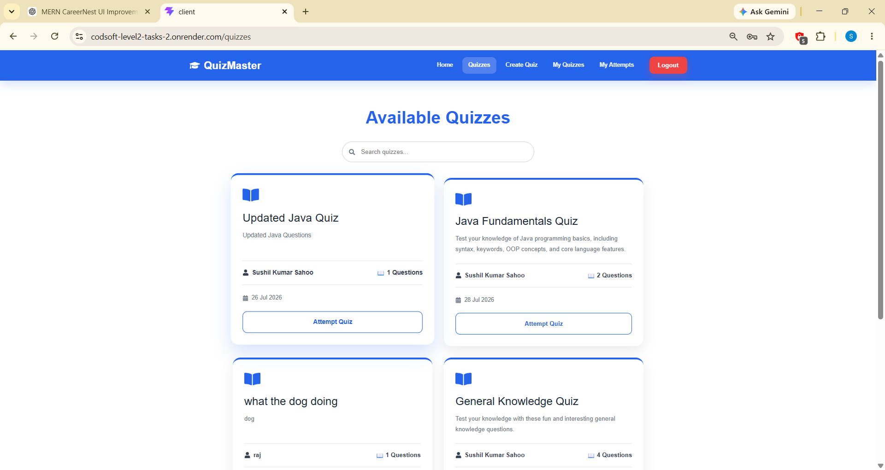
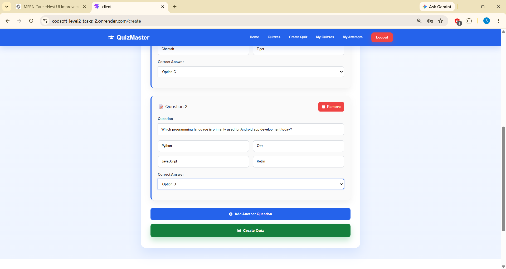
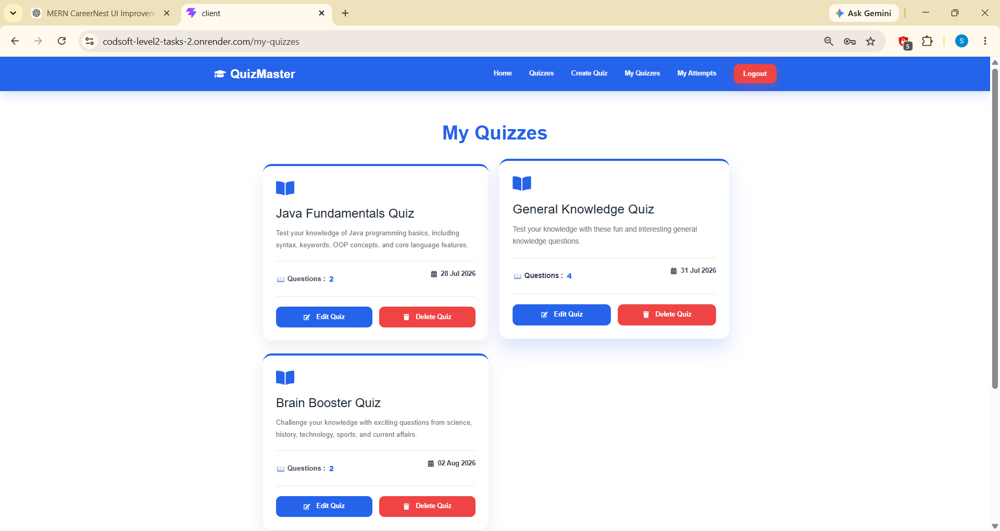
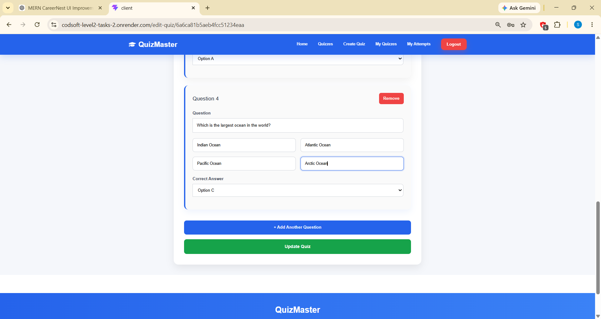
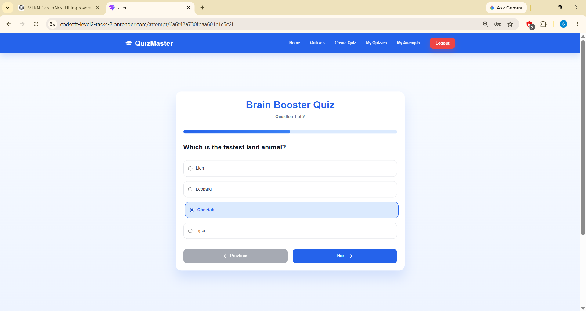
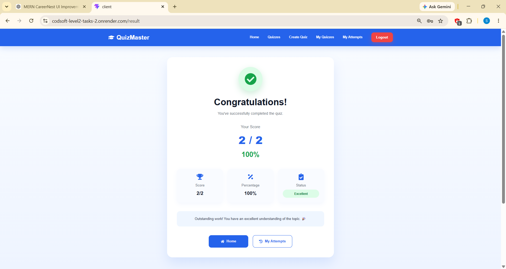
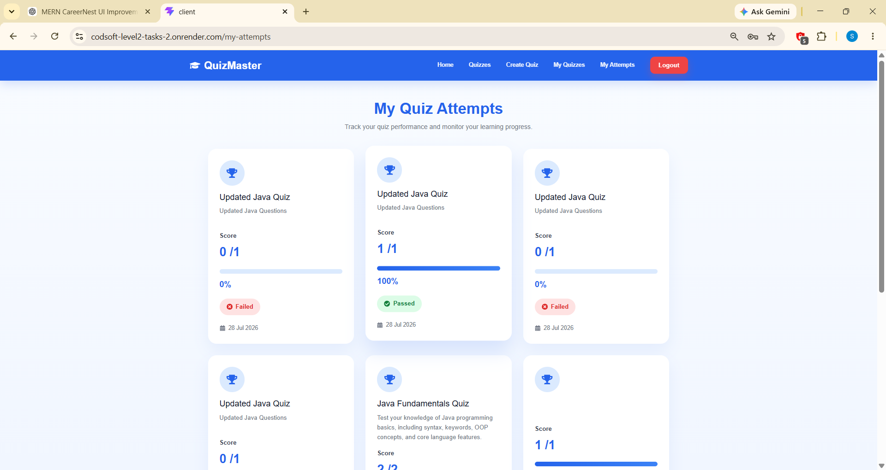

# 🎯 QuizMaker

<p align="center">
  
  
  
  
  
</p>

<p align="center">
A modern and responsive MERN Stack Quiz Platform where users can create quizzes, attempt quizzes, track their performance, and manage their own quiz collection.
</p>

---

# 🌐 Live Demo

🔗 **Application:**  
https://codsoft-level2-tasks-2.onrender.com/

---

# 📖 About The Project

QuizMaker is a full-stack quiz platform developed using the **MERN Stack**. The application allows authenticated users to create engaging multiple-choice quizzes, participate in quizzes created by others, instantly view results, and monitor their quiz history.

The project focuses on responsive design, user-friendly interfaces, secure authentication, and efficient quiz management while providing a smooth learning experience.

---

# ✨ Features

## 🔐 Authentication

- User Registration
- Secure Login
- JWT Authentication
- Protected Routes
- Logout Functionality
- Toast Notifications

---

## 📝 Quiz Management

- Create New Quiz
- Edit Existing Quiz
- Delete Quiz
- View My Quizzes
- Browse All Quizzes
- Search Quizzes
- Responsive Quiz Cards
- Pagination

---

## 🎯 Quiz Attempt

- Attempt Any Quiz
- Previous & Next Navigation
- One Question at a Time
- Automatic Score Calculation
- Instant Result Generation
- Percentage Calculation
- Pass / Fail Status

---

## 📊 Performance Tracking

- View Quiz History
- Progress Bars
- Percentage Score
- Attempt Date
- Result Status
- Pagination Support

---

## 🎨 Modern User Interface

- Responsive Design
- Bootstrap 5
- React Icons
- Professional Navbar
- Hero Section
- Animated Cards
- Interactive Buttons
- Mobile Friendly Layout

---

# 🛠 Tech Stack

## Frontend

- React.js
- React Router DOM
- Axios
- Bootstrap 5
- React Icons
- React Toastify
- CSS3

---

## Backend

- Node.js
- Express.js
- MongoDB Atlas
- Mongoose
- JWT Authentication
- bcryptjs
- CORS

---

## Deployment

- Render (Frontend)
- Render (Backend)
- MongoDB Atlas

---

# 📂 Project Structure

```
QuizMaker
│
├── client
│   ├── src
│   │   ├── api
│   │   ├── components
│   │   ├── pages
│   │   ├── services
│   │   └── App.jsx
│   │
│   └── package.json
│
├── server
│   ├── config
│   ├── controllers
│   ├── middleware
│   ├── models
│   ├── routes
│   ├── server.js
│   └── package.json
│
├── screenshots
│
└── README.md
```

---

# 📸 Application Screenshots

## 🏠 Home Page



---

## 🔐 Login Page



---

## 📝 Register Page



---

## 📚 Browse Quizzes



---

## ➕ Create Quiz



---

## 📂 My Quizzes



---

## ✏ Edit Quiz



---

## 🎯 Attempt Quiz



---

## 🏆 Quiz Result



---

## 📈 My Attempts



---

## 🗄 MongoDB Database


---

# 🚀 Getting Started

## Clone Repository

```bash
git clone https://github.com/Sushil845/CODSOFT_LEVEL2_TASKS.git
```

Navigate to the project folder.

```bash
cd QuizMaker
```

### Install Frontend

```bash
cd client
npm install
npm run dev
```

### Install Backend

```bash
cd server
npm install
npm start
```

---

# 🎯 Core Functionalities

✅ User Authentication

✅ Create Quiz

✅ Edit Quiz

✅ Delete Quiz

✅ Attempt Quiz

✅ Automatic Score Calculation

✅ Percentage Calculation

✅ Result Dashboard

✅ My Attempts History

✅ Responsive Design

✅ Protected Routes

---

# 📌 Future Enhancements

- ⏳ Quiz Timer
- 🏅 Leaderboard
- 🌙 Dark Mode
- 📂 Quiz Categories
- 🖼 Image-Based Questions
- 📈 Analytics Dashboard
- 🔔 Email Notifications
- 👨‍💼 Admin Panel
- ⭐ Favorite Quizzes
- 📱 Progressive Web App (PWA)

---

# 👨‍💻 Author

## **Sushil Kumar Sahoo**

B.Tech Computer Science & Engineering

Java Full Stack Developer | MERN Stack Developer | SAP ABAP Learner

### GitHub

https://github.com/Sushil845

### LinkedIn

https://www.linkedin.com/in/sushil-kumar-sahoo-919a1a337/

---

# 🤝 Contributing

Contributions, suggestions, and improvements are welcome.

Feel free to fork this repository and submit a Pull Request.

---

# ⭐ Support

If you found this project helpful, consider giving it a ⭐ on GitHub.

It helps others discover the project and motivates future improvements.
